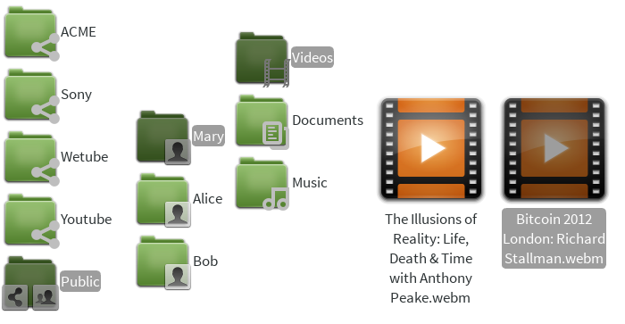

# Introduction

Bitcloud is a universal protocol aiming to provide a massive distributed filesystem, or "virtual
hark disk", capable of storing data encrypted and signed across all connected
nodes, protecting privacy and guarantying quality of service (QoS).

The easiest way to understand Bitcloud is thinking about it as a virtual
storage device in your computer, like this:

The first thing you notice is that the main "folders" are the
publishers. There are many private publishers, each one associated with normal
companies or Distributed Applications (DAs) like Wetube. There is also a
*Public grid*, in which everybody is free to publish without
censorship.

Bitcloud is *coin agnostic*, meaning that it only pretends to be the base for
the storage needs of future DAs. Bitcloud can use the escrow capabilities of
Bitcoin and/or the contracts of Ethereum. Bitcloud pretends to substitute the
way in which servers interconnect today and make much easier, secure and
private for users, publishers and DAs to share files, and will be the
*fundamental* base for the upcoming DAs.

For a technical overview, read
[bitcloud.org](https://github.com/wetube/bitcloud/blob/master/bitcloud.org).

# Help Work With Us

We want to make the process of creating Bitcloud *extremely* open, allowing
anyone who wants to participate to share their opinion and help with the
project.

# Watch Us

Please subscribe to the "issues" section in GitHub to watch us and submit your
questions and ideas there.

# Contact Us

Contact us via Freenode at: #bitcloud for general talk and #bitcloud-dev for development talk.

Contact us via the Forum at: http://talk.bitcloudproject.org/

Contact us on Reddit at: /r/bitcloud (http://www.reddit.com/r/bitcloud/)
